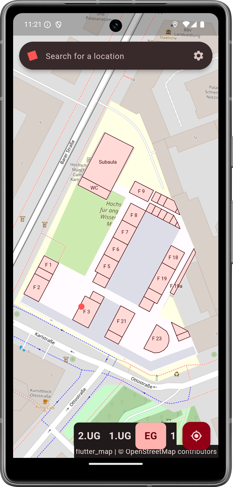

# HM Roomfinder

> This README is also available in [English](README_en.md).

> [!CAUTION]
> Dieses Projekt ist ein Prototyp.

> [!IMPORTANT]
> Dieses Projekt ist keine offizielle Software der Hochschule München. Es wurde im Rahmen eines Studentenprojekts im Modul "Mobile Anwendungen" erstellt.

## Beschreibung

HM-Roomfinder ist eine mobile Anwendung, die eine digitale Indoor-Karte der Hochschule München (HM) bereitstellt und es den Nutzern ermöglicht, nach Räumen zu suchen.
Die App wurde im Rahmen des Moduls "Mobile Anwendungen" im Studiengang Geodata Science entwickelt.

## Danke

Wir möchten uns bei den Entwickler:innen der [flutter_map](https://github.com/fleaflet/flutter_map) Bibliothek bedanken, ohne die dieses Projekt nicht möglich gewesen wäre.
Außerdem möchten wir uns bei der OSM-Community für die ausgezeichnete Basiskarte bedanken.

## Entwicklungsteam

- [Michael Albrecht](https://github.com/michael11albrecht) (GS4)
- [Paul Köhler](https://github.com/paulkoehlerdev) (GS4)

## Lizenz

Dieses Projekt ist unter der MIT-Lizenz lizenziert. Weitere Details finden Sie in der [LICENSE](LICENSE) Datei.