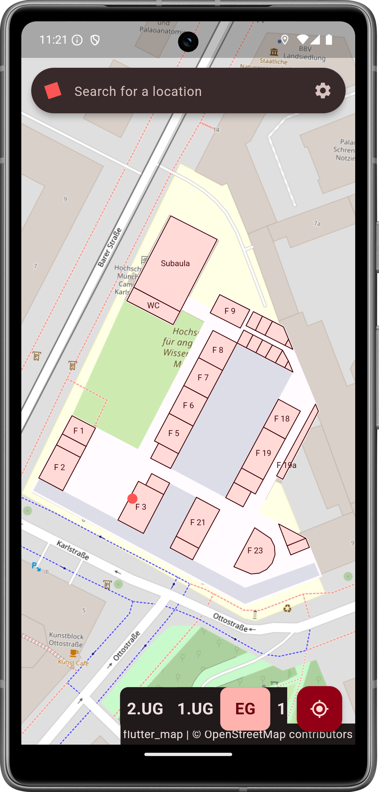
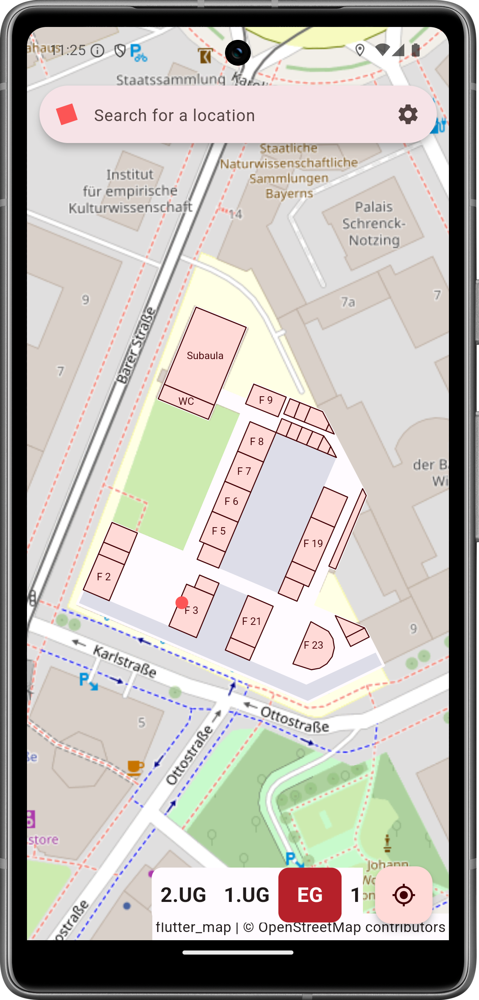

# HM Roomfinder

> [!CAUTION]
> This project is a prototype.

> [!IMPORTANT]
> This Project has no official affiliation with the University of Applied Sciences Munich. It was created as part of a student project in the module "Mobile Application Development".

| Light Mode | Dark Mode |
| --- | --- |
|  |  |

## Introduction

HM-Roomfinder is a mobile application that provides a digital indoor map of Munich University of Applied Sciences (HM) and enables users to search for rooms.
The app was developed as part of the "Mobile Applications" module in the Geodata Science degree programme.

## Special Thanks

We would like to thank the developers of the [flutter_map](https://github.com/fleaflet/flutter_map) library, without whom this project would not have been possible.
We would also like to thank the OSM community for the excellent base map.

## Entwicklungsteam

- [Michael Albrecht](https://github.com/michael11albrecht) (GS4)
- [Paul Köhler](https://github.com/paulkoehlerdev) (GS4)

## Lizenz

This project is licensed under the MIT licence. Further details can be found in the [LICENSE](LICENSE) file.